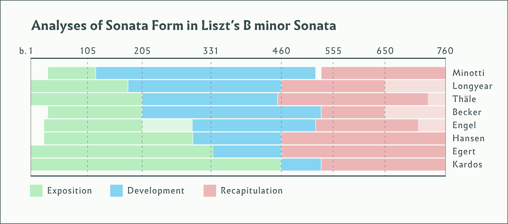

<!-- .slide: data-background="/img/liszt-manuscript-page.png" -->

  <h1>Franz Liszt</h1>
  <h2>Piano Sonata in B minor</h2>
  <h3>1853</h3>

&nbsp;

--
<!-- .slide: class="image-right" -->

&nbsp;

&nbsp;

### Franz Liszt

b. 1811, Doborján, Hungary

d. 1886, Bayreuth, Germany

<figure>

</figure>

Note:
- studies w/ Salieri & Czerny in Vienna
- succesful career as a touring pianist
- Heinrich Heine: “Lisztomania”
- retires at 35 to focus on composition
- 1848: moves to Weimar

Photo: same year as sonata

--

Dedication to Robert Schumann on First Edition title page

&nbsp;

<!-- .element: style="border: none; background: transparent; box-shadow: none; width: 85%;" -->

--

--

--

<audio controls>
  <source src="../../audio/liszt-opening-motifs-bb-1-17.ogg" type="audio/ogg">
  <source src="../../audio/liszt-opening-motifs-bb-1-17.mp3" type="audio/mpeg">
  Sorry, old browser, no audio for you.
</audio>

Note:
- a: desc. melodic minor (flat supertonic) & Hungarian minor scale
- b: angular
- c: knocking

--

  d
  <audio controls>
    <source src="../../audio/liszt-motif-d-bb-105-110.ogg" type="audio/ogg">
    <source src="../../audio/liszt-motif-d-bb-105-110.mp3" type="audio/mpeg">
    Sorry, old browser, no audio for you.
  </audio>

  e
  <audio controls>
    <source src="../../audio/liszt-motif-e-bb-334-338.ogg" type="audio/ogg">
    <source src="../../audio/liszt-motif-e-bb-334-338.mp3" type="audio/mpeg">
    Sorry, old browser, no audio for you.
  </audio>

Note:
- d arrives at first full cadential resolution (Grandioso, b.105)

--

c
<audio controls>
  <source src="../../audio/liszt-motif-c-bb-13-17.ogg" type="audio/ogg">
  <source src="../../audio/liszt-motif-c-bb-13-17.mp3" type="audio/mpeg">
  Sorry, old browser, no audio for you.
</audio>

c₁
<audio controls>
  <source src="../../audio/liszt-motif-c1-bb-153-159.ogg" type="audio/ogg">
  <source src="../../audio/liszt-motif-c1-bb-153-159.mp3" type="audio/mpeg">
  Sorry, old browser, no audio for you.
</audio>

Note:
c characterized not just by knocking, but also the repetition a step higher

--

b
<audio controls>
  <source src="../../audio/liszt-opening-motif-b-bb-9-11.ogg#t=33.545,43.5" type="audio/ogg">
  <source src="../../audio/liszt-opening-motif-b-bb-9-11.mp3#t=33.545,43.5" type="audio/mpeg">
  Sorry, old browser, no audio for you.
</audio>

bb.319–23
<audio controls>
  <source src="../../audio/liszt-superposition-bb-319-323.ogg" type="audio/ogg">
  <source src="../../audio/liszt-superposition-bb-319-323.mp3" type="audio/mpeg">
  Sorry, old browser, no audio for you.
</audio>

Note:
b augmented over the very clear statement of c

--

<audio controls>
  <source src="../../audio/liszt-figuration-bb-179-190.ogg" type="audio/ogg">
  <source src="../../audio/liszt-figuration-bb-179-190.mp3" type="audio/mpeg">
  Sorry, old browser, no audio for you.
</audio>

Note:
Not so clear, but listen for the inner voice

--
<!-- .slide: data-transition="concave-in fade-out" -->

--
<!-- .slide: data-transition="fade-in concave-out" -->

