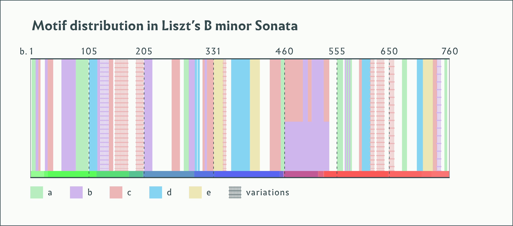

<!-- .slide: data-background="/img/liszt-manuscript-page.png" -->

  <h1>Franz Liszt</h1>
  <h2>Piano Sonata in B minor</h2>
  <h3>1853</h3>

&nbsp;

--
<!-- .slide: class="image-right" -->

&nbsp;

&nbsp;

### Franz Liszt

b. 1811, Doborján, Hungary

d. 1886, Bayreuth, Germany

<figure>

</figure>

Note:
- studies w/ Salieri & Czerny in Vienna
- succesful career as a touring pianist
- Heinrich Heine: “Lisztomania”
- retires at 35 to focus on composition
- 1848: moves to Weimar

Photo: same year as sonata

--

Dedication to Robert Schumann on First Edition title page

&nbsp;

<!-- .element: style="border: none; background: transparent; box-shadow: none; width: 85%;" -->

--

--

--

Note:
- First page:
<audio controls>
  <source src="../../audio/liszt-opening-motifs-bb-1-17.mp3" type="audio/ogg">
  <source src="../../audio/liszt-opening-motifs-bb-1-17.ogg" type="audio/mpeg">
  Sorry, old browser, no audio for you.
</audio>
- Just **a**:
<audio controls>
  <source src="../../audio/liszt-opening-motifs-bb-1-17.mp3#t=,33.134" type="audio/ogg">
  <source src="../../audio/liszt-opening-motifs-bb-1-17.ogg#t=,33.134" type="audio/mpeg">
  Sorry, old browser, no audio for you.
</audio>
- Just **b**:
<audio controls>
  <source src="../../audio/liszt-opening-motifs-bb-1-17.mp3#t=33.545,43.5" type="audio/ogg">
  <source src="../../audio/liszt-opening-motifs-bb-1-17.ogg#t=33.545,43.5" type="audio/mpeg">
  Sorry, old browser, no audio for you.
</audio>
- Just **c**:
<audio controls>
  <source src="../../audio/liszt-opening-motifs-bb-1-17.mp3#t=43.731" type="audio/ogg">
  <source src="../../audio/liszt-opening-motifs-bb-1-17.ogg#t=43.731" type="audio/mpeg">
  Sorry, old browser, no audio for you.
</audio>

--

