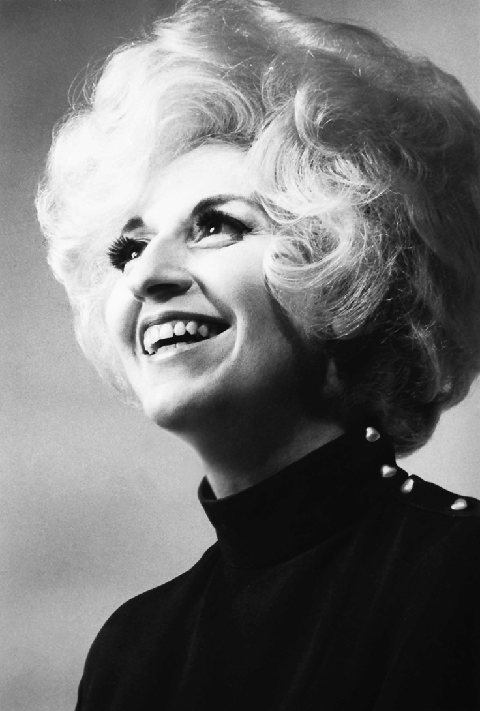

<!-- .slide: data-background="/img/berio-circles-fullscreen.png" -->

  <h2>Luciano Berio</h1>
  <h1>*Circles*</h2>
  <h3>1960</h3>

Note:
“The success of *Circles* led to increased recognition for both … established
  the pair as creators of innovative, theatrical works.” (Meehan)
--
<!-- .slide: class="image-right" -->

&nbsp;

&nbsp;

### Luciano Berio

b. 1925, Oneglia, Italy

d. 2003, Rome, Italy

<figure>

</figure>

Note:
- organist father & grandfather
- no involvement in war due to injury
- 1945 studies in Milan
- 1950 meets & marries Berberian
- 1952 studies w/ Dallapiccola
- 1955 opens Studio di Fonologia

--
<!-- .slide: class="image-right" -->

&nbsp;

&nbsp;

### Cathy Berberian

b. 1925, Attleboro, MA

d. 1983, Rome, Italy

<figure>

</figure>

Note:
- born to American Armenians
- performing arts @ Columbia & NYU
- studies in Paris (’48) & Milan (’49-50)
- collaborates w/ Berio & Studio Fon.
- ’53 break after childbirth
- ’58 premieres Cage’s _Aria_
- collaborations w/ Maderna, Haubenstock-Ramati, Stravinsky, Bussotti, Pousseur, Cage…

--
### Works involving Berberian

- 1947: *Quattro Canzoni popolari* (premiered ’52)
- 1951: *Deus meus*
- 1952: *El mar la mar*
- 1952: *Opus No. Zoo*
- 1953: *Chamber Music*
- 1958: *Thema (Omaggio a Joyce)*
- 1960: *Circles*
- 1961: *Epifanie*
- 1961: *Visage*
- 1963: *Esposizione*
- 1964: *Folk Songs*
- 1965: *Sequenza III*
- 1968: *Questo vuol dire che*
- 1972: *Recital I (for Cathy)*

<!-- .element class="no-bullets" -->

Note:
- ’53 B&B’s daughter Cristina born
- ’64 B&B separate after affair
- “Berio … inspired by her vocal virtuosity, darting, witty intelligence and vivid presence, in effect limned the voices, styles and temperament of this remarkable performer.” (Grove)
- Berio preferred to play down Berberian’s importance

--
<!-- .slide: data-background="/img/berio-studio-di-fonologia.jpg" -->
## Studio di fonologia musicale di Radio Milano

<!-- .element: class="overlay-title fragment fade-out" -->

Note:
- ’55 opens w/ Maderna as co-director
- influence of Eco
- ’59 Cage prepares version of _Fontana Mix_

--

## _Thema (Omaggio a Joyce)_
### (1958)

&nbsp;

<audio controls>
  <source src="../../audio/berio-thema.ogg" type="audio/ogg">
  <source src="../../audio/berio-thema.mp3" type="audio/mpeg">
  Sorry, old browser, no audio for you.
</audio>

Note:
- Eco introduced B. to Joyce
- B. introduces Eco to Saussure
- starts with Berberian’s evocative reading (first 2')
- creation of space *from* voice around voice
- dissolves into non-verbal atmospheres & textures

--
<!-- .slide: class="image-right" -->

### e.e. cummings

&nbsp;

- V. ‘stinging’
- &nbsp;
- IV. ‘riverly is a flower’
- &nbsp;
- XXXVIII. ‘n(o)w’

<!-- .element class="no-bullets" -->

<figure>

</figure>

Note:
- Appropriateness of Cummings for phonetic interest
- cyclical material in the text:
  - emphasised start/end S in ‘stinging’ (I/V)
  - natural cycles: death, rivers, seasons, moon, weather
--

--

--

> Berio’s fantasy does indeed always create a plan, but this is in order to play
> within its limits, to vary it without invalidating it, to enrich it without
> obscuring it beneath a mass of dovetailings and superstructures.

— Piero Santi, ‘Luciano Berio’ in *Die Reihe*, iv (1958), 102

Note:
Appeared alongside articles about Nono, Pousseur, Henze, Boulez (by Ligeti),
B.A. Zimmermann, Maderna, Stockhausen a.o.

--

> There is a continual oscillation between periodic figures, bounded by specific
> constellations of intervals, and complex gestural events characterized by a
> notable degree of indeterminacy.

— Berio, *Remembering the Future*, 118

Note:
Speaking in 1993/4, so more than 30 years after the fact

Discussion of the looseness of Berio’s structuring principles

--

Demonstrate repeated pitch material I —> IV

--

Similarly with instrumentation across the work

--

End with rearticulation of texts (ABCBA) vs. musical material (arguably ABCAB)
