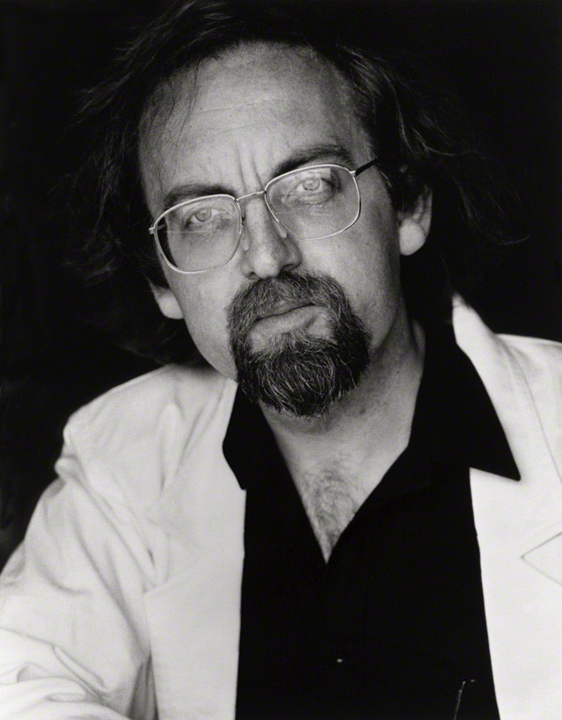

# Brian Ferneyhough
## *Time and Motion Study II*
### 1973–76

--
<!-- .slide: class="image-right" -->

&nbsp;

&nbsp;

### Brian Ferneyhough

b. 1943, Coventry, UK

<figure>

</figure>

Note:

Photo: August 1988, Betty Freeman

--

Note:
- 2 looping tapes (14" & 9")
- 2 contact mics, 1 throat, 1 “air”
- 2 foot pedals
- ring modulator
- ≥ 2 assistants
- “electronic environment” (*CW*, p.13)

--
<!-- .slide: data-background="#000000" -->
<video controls>
  <source data-src="video/gilbreth-stamping.mp4" type="video/mp4">
  <source data-src="video/gilbreth-stamping.webm" type="video/webm">
  Sorry, old browser, no video for you.
</video>

Note:
- Frank Bunker & Lillian M. Gilbreth
- video: 1910–1924

--
Ferneyhough, *Collected Writings*:

> “…the ‘memory of a production process’, the place of performance as the point
> of confrontation for **objectively measurable systems** and **subjective
> obscuration, erosion and eradication**” (107)

&nbsp;

> “…between **objectively measurable systems** and their nemesis, **subjective
> criteria of retention**.” (114)

--
<!-- .slide: data-background="#000000" -->
<video controls>
  <source data-src="video/bf-rendering-deceptive.mp4" type="video/mp4">
  Sorry, old browser, no video for you.
</video>

Note:

from: *Electric Chair Music*, 2005

directed by Colin Still

--
<!-- .slide: data-background="#000000" -->
<video controls>
  <source data-src="video/bf-scream.mp4" type="video/mp4">
  Sorry, old browser, no video for you.
</video>
